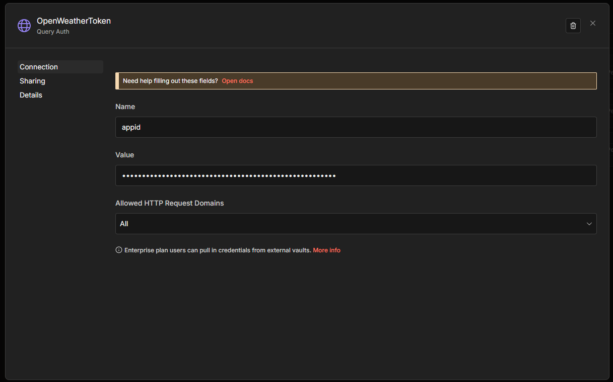

# Telegram Weather Bot (Brasil)

Este projeto consiste em um bot para Telegram que informa o clima de cidades do Brasil a partir do nome da cidade informada pelo usuário.

O bot consulta dados meteorológicos em tempo real utilizando a OpenWeather API e responde automaticamente pelo Telegram.

## Funcionalidades

Consulta e retorna o clima (temperatura) por nome da cidade brasileira.

## Como executar o projeto

Importe o arquivo do workflow (workflow-telegram-chatbot.json) no seu n8n.

Passos:

1. Acesse sua instância do n8n

2. Vá em Import

3. Selecione o arquivo workflow-telegram-chatbot.json

4. Confirme a importação

## Configurar as variáveis de ambiente

Após importar o workflow, você deve substituir as variáveis abaixo por valores válidos:

### Variáveis obrigatórias:

- **OPENWEATHER_API_TOKEN** (Chave da API do OpenWeather. Obtida em: https://openweathermap.org/api e deve ser incluída no Credencial Manager do seu n8n com o tipo "Query Auth" com nome "OpenWeatherToken" contendo a configuração de variável { name: 'appid', value: 'SEU_OPENWEATHER_API_TOKEN' })

Importante: Não se esqueça de atualizar o apontamento da sua variável após importar pois o ID da credencial pode mudar e quebrar o fluxo, então é importante que crie a credential e verifique o nó HTTP se está puxando corretamente a chave do token.

- **TELEGRAM_BOT_TOKEN** (Token do bot do Telegram. Pode ser criado via @BotFather. Deve ser incluída como uma Credencial do Telegram pelo nó no seu n8n: credentials.telegamApi)

## Requisitos

Instância funcional do n8n

Conta e API Key válida no OpenWeather

Bot criado no Telegram

## Observações

O bot reconhece nomes de cidades do Brasil

Certifique-se de que o workflow esteja ativado no n8n para que o bot funcione corretamente

É recomendado testar o fluxo manualmente após a configuração. O retorno com sucesso deve retornar uma mensagem do tipo "A temperatura em Campinas é de 22ºC" e o retorno de erro deve retornar um mensagem do tipo "Desculpe, não conheço a cidade XYZ. Me informe o nome e a UF de uma cidade brasileira. Exemplo: Campinas, SP"

Use "Campinas, SP" (ou otra cidade existente) para testar uma resposta de sucesso, e "XYZ, SP" (ou qualquer outra palavra que não seja uma cidade) para testar uma resposta de cidade inválida. Teste também um erro de retorno HTTP informando uma nome se o estado, exemplo "ABCDE"

## Licença

Este projeto foi desenvolvido fins educacionais
